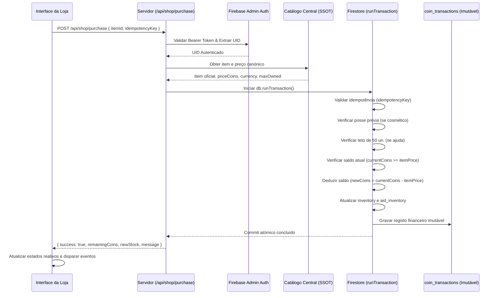

# 🇵🇹 RELATÓRIO DE SEGURANÇA & ARQUITETURA DE COMPRAS

**Data:** 02 de Setembro de 2026  
**Sistema:** Acorda Portugal — Motor Financeiro e de Transações da Loja  
**Autoridade de Validação:** `app/api/shop/purchase/route.ts`  
**Espelho de Compatibilidade:** `app/api/buy-item/route.ts`

---

## 1. FLUXO TRANSACIONAL SEGURO (ZERO CLIENT-SIDE MUTATION)

Antes da intervenção forense, existiam rotas legadas e scripts de cliente que executavam `deductCoins()` e gravavam inventários diretamente no navegador (`localStorage` ou chamadas desprotegidas ao Firestore).

### Novo Ciclo Canónico de Compra:


---

## 2. VULNERABILIDADES ELIMINADAS & MECANISMOS DE DEFESA

| # | Vetor de Ataque / Falha | Mecanismo de Defesa Implementado | Resultado |
| :---: | :--- | :--- | :---: |
| 1 | **Manipulação de Preço no Cliente** | O cliente envia exclusivamente o `itemId`. O servidor consulta unicamente `lib/shop-catalog.ts`. Qualquer valor monetário enviado no payload é solenemente descartado. | **BLINDADO** |
| 2 | **Saldo Negativo via Concorrência** | Transação atómica com `db.runTransaction()`. Se o saldo no momento exato do commit for inferior ao preço, a transação lança exceção e reverte. | **BLINDADO** |
| 3 | **Duplo Clique / Retry de Rede** | Chave `idempotencyKey` única por tentativa de compra. Verificação na coleção `coin_transactions` antes de debitar. Se a chave já existir, retorna o resultado anterior sem novo débito. | **BLINDADO** |
| 4 | **Compra de Itens VIP com Moedas** | Verificação estrita de catálogo: itens com `currency === 'real_eur'` ou `unlockType === 'vip'` são sumariamente rejeitados com HTTP 403 Forbidden. | **BLINDADO** |
| 5 | **Compra de Itens de Mérito** | Itens com `unlockType === 'achievement'` ou `priceCoins === null` não possuem rota de compra por moedas, exigindo validação de desafios/níveis. | **BLINDADO** |
| 6 | **Acumulação Abusiva de Ajudas** | Verificação do limite de 50 unidades (`AID_MAX_OWNED_LIMIT`). Se `currentStock + packQuantity > 50`, a compra é rejeitada com mensagem informativa. | **BLINDADO** |
| 7 | **Fraude em Duelos 1v1** | O motor de consumo `/api/shop/aid/consume` valida o `gameMode` e bloqueia qualquer consumo em duelos competitivos 1v1. | **BLINDADO** |

---

## 3. REGISTO FINANCEIRO IMUTÁVEL (`coin_transactions`)

Todas as alterações no saldo de moedas de um jogador são obrigatoriamente arquivadas na coleção raiz imutável `coin_transactions`:

```json
{
  "transactionId": "tx_pur_1725280000000_abc123",
  "userId": "usr_789xyz",
  "type": "spend",
  "amount": -750,
  "currency": "coins",
  "balanceBefore": 2250,
  "balanceAfter": 1500,
  "reason": "Compra na Loja: Pack x5 Ajudas 50/50",
  "itemId": "aid_50_50",
  "itemType": "aid",
  "idempotencyKey": "pur_uuid_v4_unique_token",
  "createdAt": "2026-09-02T13:20:00.000Z",
  "metadata": {
    "packQuantity": 5,
    "source": "shop_web"
  }
}
```

O documento é simultaneamente gravado na subcoleção de histórico pessoal `users/{uid}/transactions/{txId}` para consulta transparente pelo utilizador na interface da sua carteira.

---

## 4. LOGGING ESTRUTURADO DE AUDITORIA

Todas as operações geram logs com eventos normalizados no stdout do servidor:
- `[SHOP_PURCHASE_STARTED]`
- `[SHOP_PURCHASE_IDEMPOTENT_HIT]`
- `[SHOP_PURCHASE_FAILED]` (com motivo: `INSUFFICIENT_FUNDS`, `ITEM_NOT_FOUND`, `MAX_STOCK_REACHED`, `VIP_OR_MERIT_ITEM`)
- `[SHOP_PURCHASE_SUCCESS]`
- `[SHOP_ITEM_UNLOCKED]`
- `[AID_PURCHASED]`
- `[AID_CONSUMED]`
- `[COIN_TRANSACTION]`

Este sistema confere total rastreabilidade forense a qualquer discrepância económica futura.
